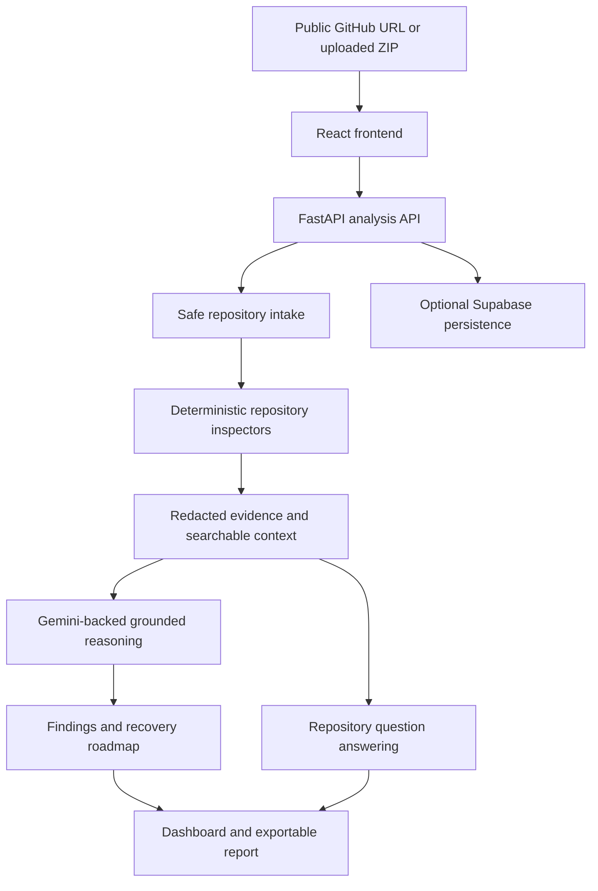

# RepoRevive — Product Requirements Document

**Tagline:** Understand. Diagnose. Revive.  
**Document status:** Approved project-start baseline  
**Version:** 1.0  
**Date:** August 24, 2026  
**Product owner:** Aneruth G J (Ane)  
**Frontend owner:** ChatGPT / Codex  
**Backend owner:** Claude  
**Initial delivery:** Standalone application  
**Future direction:** Optional integration into Rosaline MAP

---

## 1. Product summary

RepoRevive is an AI-assisted software repository analysis and recovery application. A developer submits a public GitHub repository URL or uploads a source-code ZIP archive. RepoRevive inspects supported source files, identifies the technology stack, detects evidence-backed engineering issues, answers questions about the codebase, and produces a prioritized recovery plan.

The product combines deterministic inspection with grounded language-model reasoning. It must distinguish confirmed findings from inferred risks and must never present an unverified claim as a proven fact.

### Product promise

> Understand an unfamiliar or unfinished repository, identify what needs attention, and know which engineering task to tackle next.

### Initial product boundaries

- RepoRevive launches as a standalone web application.
- The MVP supports public repositories and explicitly uploaded ZIP files only.
- Repository contents are inspected, not executed.
- Proposed fixes are advisory; no files are changed automatically.
- Future Rosaline MAP integration is an architectural consideration, not an MVP dependency.

---

## 2. Problem statement

Developers regularly inherit repositories with incomplete features, weak documentation, broken configuration, inconsistent APIs, missing tests, or unclear deployment requirements. Existing conversational AI tools can help, but their answers become unreliable when they cannot inspect relevant files or when they speculate about missing implementation.

RepoRevive addresses four practical questions:

1. What does this project contain?
2. What appears broken, risky, or incomplete?
3. Which files support those conclusions?
4. What should the developer do next?

---

## 3. Target users

### Primary users

- Developers returning to unfinished personal projects.
- Engineers onboarding to an unfamiliar codebase.
- Freelancers assessing inherited client work.
- Startup founders managing multiple applications.
- Students preparing a project for demonstration or deployment.

### Secondary users

- Engineering managers reviewing project readiness.
- Small development agencies assessing technical handovers.
- Open-source maintainers reviewing documentation and test coverage.
- Technical recruiters evaluating a candidate's project documentation.

---

## 4. Product goals and non-goals

### Goals

- Identify supported technologies using repository evidence.
- Map relationships between frontend, backend, configuration, and persistence layers.
- Produce actionable findings with file paths and supporting evidence.
- Identify selected configuration, dependency, API-contract, documentation, and testing issues.
- Generate a prioritized recovery roadmap.
- Answer repository questions using retrieved source context.
- Demonstrate full-stack AI application engineering, retrieval, tool use, evaluation, and security awareness.
- Keep a portfolio-sized deployment within available free-tier quotas where practical.

### Non-goals for version 1

- Editing repositories, committing code, opening pull requests, or deploying user projects.
- Accessing private repositories without an explicitly designed authorization flow.
- Running uploaded code, package installation scripts, arbitrary shell commands, or repository test suites.
- Performing a comprehensive security audit or claiming security certification.
- Guaranteeing complete bug detection or correct diagnosis for every repository.
- Processing unlimited files, large monorepositories, binary assets, or unsupported languages.
- Storing or displaying unredacted access tokens, API keys, credentials, or sensitive repository contents.

---

## 5. Brand and visual identity

### Name and tagline

**Product name:** RepoRevive  
**Tagline:** Understand. Diagnose. Revive.

### Approved icon

Use the user-supplied icon showing a geometric neon-red repository/cube mark on a dark background as the official project brand asset.

Suggested project location after implementation:

```text
frontend/public/brand/reporevive-icon.jpg
```

The uploaded icon must not be assumed to have a transparent background. Create separate favicon or transparent assets only if the user later requests them.

### Visual direction

- Dark developer-tool interface.
- Near-black or deep-navy application background.
- Neon crimson as the primary interactive accent.
- Off-white primary text and muted grey supporting text.
- Green for positive checks, amber for warnings, and red for critical findings.
- Restrained glow, subtle borders, and clear severity badges.
- Monospace typography for paths, configuration keys, and code excerpts.
- Responsive layouts suitable for desktop and mobile.

Suggested starting design tokens, subject to visual adjustment:

```css
--color-background: #090611;
--color-surface: #120d1d;
--color-surface-elevated: #1a1326;
--color-primary: #f20c50;
--color-text: #f8f7fb;
--color-text-muted: #9d97aa;
--color-success: #22c55e;
--color-warning: #f59e0b;
--color-danger: #ef4444;
--color-info: #38bdf8;
```

---

## 6. MVP user journey

1. The user opens the RepoRevive landing page.
2. The user chooses a public GitHub repository URL or uploads a ZIP archive.
3. The application explains that selected source excerpts may be sent to the configured AI provider.
4. The user submits the repository for analysis.
5. The frontend displays analysis stages and polls the analysis status endpoint.
6. The backend validates and safely inspects supported repository files.
7. Deterministic analyzers collect stack, configuration, API, documentation, and security evidence.
8. The AI layer creates grounded explanations and a recovery roadmap from sanitized evidence.
9. The dashboard displays architecture, findings, and readiness information.
10. The user asks follow-up questions and receives cited answers.
11. The user exports or prints an analysis report.
12. The user may explicitly delete the stored analysis.

---

## 7. Supported technologies and repository boundaries

### First-class MVP support

- JavaScript and TypeScript applications.
- React and Vite frontend projects.
- Python applications.
- FastAPI backend projects.
- Node.js and Express projects where detection is straightforward.
- Common configuration formats, including JSON, TOML, YAML, Markdown, and environment templates.

### Files commonly inspected

```text
package.json
package-lock.json
requirements.txt
pyproject.toml
README.md
vite.config.*
tsconfig.json
Dockerfile
docker-compose.yml
render.yaml
.env.example
src/**/*
app/**/*
backend/**/*
frontend/**/*
tests/**/*
```

### Paths normally ignored

```text
node_modules/
dist/
build/
coverage/
.git/
.venv/
venv/
__pycache__/
vendor/
generated binary files
images, videos, archives, and other non-source binaries
```

### Initial safety limits

- Maximum compressed ZIP size: 10 MB.
- Maximum extracted ZIP contents: 50 MB.
- Maximum inspected files: 1,000.
- Maximum individual text file size: 256 KB.
- Maximum relevant files sent through AI summarization per analysis: configurable; start at 100 or fewer.
- Restrict accepted GitHub URLs to valid public `github.com/{owner}/{repository}` repositories.
- Make limits configurable through backend environment variables.

These limits are starting product requirements and may be adjusted after testing.

---

## 8. Functional requirements

### FR-01: Public GitHub repository submission

The system must validate supported public GitHub repository URLs, reject unsupported hosts and malformed paths, and provide understandable error messages. The MVP must not request private-repository credentials.

### FR-02: ZIP archive upload

The system must accept supported ZIP files, enforce size and extraction limits, reject path-traversal attempts, avoid symlinks where applicable, and exclude unsupported binary or generated files.

### FR-03: Stack detection

The system must determine supported frontend frameworks, backend frameworks, package managers, configuration files, test frameworks, and database references from explicit repository evidence.

### FR-04: Architecture summary

The system must describe detected components and relationships. A component that cannot be confirmed must be marked unknown or inferred rather than reported as fact.

### FR-05: Configuration inspection

The system should identify selected environment-variable references, absent environment templates, inconsistent base URLs, missing configuration documentation, and other verifiable configuration risks.

### FR-06: API contract comparison

For supported applications, the system should inspect frontend HTTP calls and backend route declarations, compare paths and methods, and flag potential mismatches with the relevant source paths.

### FR-07: Secret-pattern detection

The system should detect suspicious credential patterns, redact potentially sensitive values before persistence or AI transmission, and return masked warnings. Findings must be described as potential exposures unless independently confirmed.

### FR-08: Testing and documentation assessment

The system should identify the presence or absence of recognizable test directories, test dependencies, README content, setup instructions, and deployment configuration.

### FR-09: Evidence-backed findings

Every finding must include a category, severity, title, explanation, source evidence, file path when available, confidence, and recommended next action. Unsupported speculation must not appear as a confirmed finding.

### FR-10: Recovery roadmap

The system must create a prioritized recovery roadmap organized around blockers, security-sensitive work, deployment readiness, tests, and optional improvements.

### FR-11: Repository-grounded chat

The system must retrieve relevant project context and answer questions with source citations. If the repository does not provide enough evidence, the response must say so explicitly.

### FR-12: Analysis report

The system must return a structured report containing the overview, architecture, findings, recovery roadmap, evidence references, and known limitations. The frontend must provide a print-friendly or downloadable representation.

### FR-13: Analysis deletion

The user must be able to request deletion of a stored analysis and its associated application-managed data.

### FR-14: Observability

The system should track analysis duration, files inspected, findings by severity, relevant AI-provider failures, and evaluation results without logging secret values or full sensitive source documents.

---

## 9. Interface and screen requirements

### Landing page

- Brand icon and product tagline.
- Public GitHub URL input.
- ZIP upload control.
- Primary analysis action.
- Short feature explanation.
- Data-processing and privacy notice.
- Optional sample repository analysis.

### Analysis progress screen

- Repository validation.
- File-tree inspection.
- Stack detection.
- Configuration checks.
- API-route analysis.
- Secret-pattern checks.
- Grounded AI analysis.
- Roadmap and report preparation.

### Dashboard

- Repository identity and analysis timestamp.
- Detected stack.
- Files inspected.
- Summary of finding counts by severity.
- Analysis duration.
- Testing and documentation indicators.
- Deployment-readiness summary.

Any health or readiness score must be described as a heuristic, not as a formal security assessment.

### Architecture view

- Frontend, backend, persistence, external service, and deployment components.
- Relationships where evidence exists.
- Supporting file paths.
- Unknown components clearly marked.

### Findings view

- Search and filtering by severity, category, and file.
- Expandable evidence and recommendations.
- Confidence indicator.
- Masked presentation of sensitive values.

### Roadmap view

- Immediate blockers.
- Security and configuration issues.
- Deployment prerequisites.
- Testing and documentation improvements.
- Optional enhancements.

### Codebase chat

- User question input.
- Grounded answer.
- Source citations.
- Follow-up questions.
- Explicit uncertainty states.

### Report view

- Executive summary.
- Stack and architecture.
- Findings and evidence.
- Recovery roadmap.
- Evaluation or testing indicators.
- Known limitations.
- Print or export action.

---

## 10. Technical architecture



### Suggested implementation stack

| Component | Technology | Owner |
| --- | --- | --- |
| Frontend | React, Vite, TypeScript, Tailwind CSS | ChatGPT / Codex |
| Client data fetching | Fetch API or TanStack Query | ChatGPT / Codex |
| Backend | Python, FastAPI, Pydantic | Claude |
| Repository inspection | Python filesystem tools, GitHub API, AST or supported parsers | Claude |
| AI generation | Configurable Gemini API model | Claude |
| Retrieval | Lexical retrieval initially; embeddings and `pgvector` when available | Claude |
| Database | Supabase PostgreSQL when persistence is required | Claude |
| Frontend tests | Vitest and React Testing Library | ChatGPT / Codex |
| Backend tests | Pytest | Claude |
| Hosting | Free-tier-compatible static hosting and Python web hosting | Ane with implementation support |
| Repository | GitHub | Ane |

The model name must be configured with an environment variable rather than hard-coded, because provider availability and free-tier eligibility may change.

---

## 11. Shared API contract

The frontend and backend must use this contract as the shared source of truth. Changes require agreement before either implementation changes endpoint paths or response shapes.

### Endpoints

| Method | Endpoint | Purpose |
| --- | --- | --- |
| `GET` | `/health` | Backend health and service readiness |
| `POST` | `/api/repositories/analyze` | Start public GitHub repository analysis |
| `POST` | `/api/repositories/upload` | Start ZIP archive analysis |
| `GET` | `/api/analysis/{analysis_id}` | Retrieve analysis status and summary |
| `GET` | `/api/analysis/{analysis_id}/architecture` | Retrieve architecture information |
| `GET` | `/api/analysis/{analysis_id}/findings` | Retrieve evidence-backed findings |
| `GET` | `/api/analysis/{analysis_id}/roadmap` | Retrieve prioritized recovery tasks |
| `POST` | `/api/analysis/{analysis_id}/chat` | Ask a repository-grounded question |
| `GET` | `/api/analysis/{analysis_id}/report` | Retrieve complete report data |
| `DELETE` | `/api/analysis/{analysis_id}` | Delete analysis data |

### Analysis states

```text
queued
running
completed
failed
```

### Start public repository analysis

```http
POST /api/repositories/analyze
Content-Type: application/json
```

```json
{
  "repository_url": "https://github.com/example/example-project"
}
```

```json
{
  "analysis_id": "analysis_001",
  "status": "queued",
  "repository": {
    "name": "example-project",
    "source_type": "github",
    "url": "https://github.com/example/example-project"
  }
}
```

### Upload ZIP archive

```http
POST /api/repositories/upload
Content-Type: multipart/form-data
```

Form field:

```text
file: source-code.zip
```

Response uses the same analysis-start shape with `source_type` set to `zip`.

### Analysis summary response

```json
{
  "analysis_id": "analysis_001",
  "status": "completed",
  "stage": "complete",
  "repository": {
    "name": "example-project",
    "source_type": "github",
    "url": "https://github.com/example/example-project"
  },
  "stack": {
    "frontend": ["React", "Vite", "TypeScript"],
    "backend": ["FastAPI", "Python"],
    "database": ["PostgreSQL"],
    "testing": ["Pytest", "Vitest"]
  },
  "summary": {
    "files_analyzed": 82,
    "analysis_duration_ms": 6840,
    "findings_by_severity": {
      "critical": 0,
      "high": 2,
      "medium": 3,
      "low": 1
    },
    "readiness_label": "needs_attention"
  },
  "created_at": "2026-08-24T12:00:00Z",
  "completed_at": "2026-08-24T12:00:07Z"
}
```

### Finding response

```json
{
  "items": [
    {
      "id": "finding_001",
      "severity": "high",
      "category": "api_mismatch",
      "title": "Frontend endpoint has no matching backend route",
      "description": "A frontend request references a route that was not found in the supported backend route map.",
      "file": "frontend/src/services/jobs.ts",
      "line": 24,
      "evidence": "POST /api/jobs/search",
      "confidence": 0.91,
      "recommendation": "Implement the matching backend route or update the frontend API contract.",
      "verification_status": "evidence_backed"
    }
  ],
  "total": 1
}
```

### Architecture response

```json
{
  "components": [
    {
      "id": "frontend",
      "type": "frontend",
      "label": "React + Vite",
      "evidence_files": ["frontend/package.json"]
    },
    {
      "id": "backend",
      "type": "backend",
      "label": "FastAPI",
      "evidence_files": ["backend/app/main.py"]
    }
  ],
  "connections": [
    {
      "source": "frontend",
      "target": "backend",
      "label": "HTTP API",
      "evidence_files": ["frontend/src/api/client.ts"]
    }
  ]
}
```

### Roadmap response

```json
{
  "items": [
    {
      "id": "task_001",
      "priority": "high",
      "title": "Resolve missing API endpoint",
      "description": "Align the frontend job-search request with a supported backend route.",
      "related_finding_ids": ["finding_001"],
      "related_files": [
        "frontend/src/services/jobs.ts",
        "backend/app/main.py"
      ],
      "estimated_complexity": "medium"
    }
  ]
}
```

### Chat request and response

```json
{
  "question": "Why does the job search feature appear incomplete?"
}
```

```json
{
  "answer": "The frontend contains a job-search request, but the inspected backend route map does not contain a matching endpoint.",
  "citations": [
    {
      "file": "frontend/src/services/jobs.ts",
      "line": 24,
      "excerpt": "POST /api/jobs/search"
    }
  ],
  "confidence": 0.89,
  "insufficient_evidence": false
}
```

### Complete report response

`GET /api/analysis/{analysis_id}/report` returns a single flat bundle. The nested
`architecture`, `findings`, and `roadmap` objects use the exact shapes defined in
their own endpoint sections above.

```json
{
  "analysis_id": "analysis_001",
  "status": "completed",
  "repository": {
    "name": "example-project",
    "source_type": "github",
    "url": "https://github.com/example/example-project"
  },
  "overview": "Inspected 82 source file(s). Detected React, Vite, TypeScript frontend; FastAPI, Python backend; PostgreSQL storage. Found 6 finding(s): 0 critical, 2 high, 3 medium, 1 low. Most severe: Frontend endpoint has no matching backend route.",
  "readiness_label": "needs_attention",
  "stack": {
    "frontend": ["React", "Vite", "TypeScript"],
    "backend": ["FastAPI", "Python"],
    "database": ["PostgreSQL"],
    "testing": ["Pytest", "Vitest"]
  },
  "summary": {
    "files_analyzed": 82,
    "analysis_duration_ms": 6840,
    "findings_by_severity": {
      "critical": 0,
      "high": 2,
      "medium": 3,
      "low": 1
    },
    "readiness_label": "needs_attention"
  },
  "architecture": {
    "components": [
      {
        "id": "frontend",
        "type": "frontend",
        "label": "React + Vite",
        "evidence_files": ["frontend/package.json"]
      },
      {
        "id": "backend",
        "type": "backend",
        "label": "FastAPI",
        "evidence_files": ["backend/app/main.py"]
      },
      {
        "id": "database",
        "type": "persistence",
        "label": "PostgreSQL",
        "evidence_files": ["backend/requirements.txt"]
      }
    ],
    "connections": [
      {
        "source": "frontend",
        "target": "backend",
        "label": "HTTP API",
        "evidence_files": []
      },
      {
        "source": "backend",
        "target": "database",
        "label": "Database connection",
        "evidence_files": ["backend/requirements.txt"]
      }
    ]
  },
  "findings": {
    "items": [
      {
        "id": "finding_001",
        "severity": "high",
        "category": "api_mismatch",
        "title": "Frontend endpoint has no matching backend route",
        "description": "A frontend request references a route that was not found in the supported backend route map.",
        "file": "frontend/src/services/jobs.ts",
        "line": 24,
        "evidence": "POST /api/jobs/search",
        "confidence": 0.75,
        "recommendation": "Implement the matching backend route or update the frontend to call an existing endpoint.",
        "verification_status": "evidence_backed"
      }
    ],
    "total": 6
  },
  "roadmap": {
    "items": [
      {
        "id": "task_001",
        "priority": "high",
        "title": "Resolve API contract mismatches",
        "description": "Align frontend calls with backend routes so core features work end to end. (2 related finding(s)).",
        "related_finding_ids": ["finding_001"],
        "related_files": ["frontend/src/services/jobs.ts"],
        "estimated_complexity": "medium"
      }
    ]
  },
  "limitations": [
    "Repository contents are inspected, not executed.",
    "Findings are advisory and may include false positives or missed issues.",
    "Only supported languages and configuration formats are analyzed.",
    "Readiness is a heuristic label, not a formal security assessment."
  ],
  "generated_at": "2026-08-24T12:00:09Z"
}
```

Notes:

- `architecture.components[].type` is one of `frontend`, `backend`, `persistence`,
  `external_service`, `deployment`, or `unknown` (PRD section 9 taxonomy).
- `roadmap.items[].estimated_complexity` is one of `low`, `medium`, `high`.
- `finding.category` is one of `stack`, `configuration`, `api_mismatch`, `secret`,
  `testing`, `documentation`, `dependency`, `deployment`, or `architecture`.

### Standard error response

```json
{
  "error": {
    "code": "INVALID_REPOSITORY_URL",
    "message": "Enter a valid public GitHub repository URL.",
    "request_id": "req_123"
  }
}
```

Suggested error codes:

```text
INVALID_REPOSITORY_URL
REPOSITORY_NOT_FOUND
PRIVATE_REPOSITORY_UNSUPPORTED
REPOSITORY_TOO_LARGE
INVALID_ARCHIVE
ARCHIVE_TOO_LARGE
UNSAFE_ARCHIVE_ENTRY
ANALYSIS_NOT_FOUND
ANALYSIS_NOT_READY
AI_PROVIDER_UNAVAILABLE
AI_QUOTA_EXCEEDED
RATE_LIMITED
INTERNAL_ERROR
```

---

## 12. Frontend ownership — ChatGPT / Codex

### Required deliverables

- Initialize a React + Vite + TypeScript frontend.
- Configure Tailwind CSS and the RepoRevive design system.
- Add the approved user-supplied brand icon.
- Build the landing page and repository submission experience.
- Implement GitHub URL validation and ZIP upload UI.
- Implement analysis-stage polling and progress states.
- Build dashboard, architecture, findings, roadmap, chat, and report screens.
- Implement reusable cards, tables, severity badges, citation panels, and error states.
- Connect the frontend to every agreed backend endpoint.
- Support responsive desktop and mobile layouts.
- Add environment-based backend URL configuration.
- Add component and client-integration tests.
- Verify production build, linting, and relevant frontend tests.
- Document local setup and frontend deployment.

### Frontend acceptance criteria

- A valid public GitHub repository URL can be submitted.
- A valid ZIP archive can be selected and uploaded.
- Invalid input produces accessible, understandable feedback.
- Analysis states update without requiring a manual page refresh.
- Dashboard information renders from real backend responses.
- Findings can be filtered and their file evidence can be inspected.
- Grounded chat answers show source citations.
- Empty, loading, provider-error, and failed-analysis states are handled.
- No Gemini key, GitHub credential, or backend secret is exposed to the browser.
- The application builds successfully for production.

---

## 13. Backend ownership — Claude

### Required deliverables

- Initialize a Python FastAPI application with Pydantic schemas.
- Implement every endpoint defined in the shared API contract.
- Validate public GitHub URLs and fetch repository contents safely.
- Implement ZIP upload, extraction limits, and path-traversal protection.
- Detect supported stacks, dependencies, configuration files, and frameworks.
- Extract supported frontend API calls and backend route declarations.
- Identify verifiable route and method mismatches.
- Detect environment-variable references and selected documentation gaps.
- Implement masked secret-pattern detection.
- Build repository-context retrieval using lexical search or supported embeddings.
- Integrate a configurable Gemini model through a server-side API key.
- Generate structured, grounded findings and recovery-roadmap tasks.
- Implement repository question answering with file citations.
- Track analysis states, duration, and file counts.
- Add CORS configuration, request IDs, structured errors, and sensible rate limits.
- Provide OpenAPI documentation and environment-variable examples.
- Write Pytest coverage for endpoint behavior, analyzers, archive safety, redaction, and AI failure handling.
- Prepare backend deployment configuration.

### Backend safety requirements

- Do not execute code from analyzed repositories.
- Do not run package-manager install hooks or user-supplied shell commands.
- Do not trust archive file paths or symlinks.
- Do not send unredacted suspected secrets to an AI provider.
- Do not log raw API keys or full sensitive repository contents.
- Do not fetch arbitrary user-supplied internal or non-GitHub URLs.
- Do not claim that an inferred issue is confirmed without file evidence.
- Do not alter frontend/backend API schemas without coordinating the contract change.

### Backend acceptance criteria

- `/health` responds successfully.
- Valid public repositories can be analyzed.
- Invalid, private, unsupported, or oversized repositories fail safely.
- Valid ZIP uploads can be analyzed.
- Unsafe archives are rejected.
- Detected stacks and findings contain supporting evidence.
- Suspected credential values are masked.
- Supported API mismatches are detected in controlled sample repositories.
- Grounded chat produces citations or explicitly states insufficient evidence.
- AI quota or provider failures produce structured, recoverable error responses.
- Pytest coverage passes for required behaviors.
- OpenAPI documentation is available.

---

## 14. Product-owner responsibilities — Ane

- Create or approve the GitHub repository.
- Provide the approved icon for frontend integration.
- Obtain and configure a supported Gemini API key.
- Provide Claude with the backend requirements and API contract.
- Share the backend repository, deployment URL, or source with the frontend implementation when available.
- Configure hosting accounts and deployment environment variables.
- Approve any changes to product scope or the shared API contract.
- Use public, synthetic, or explicitly authorized repository data for testing.
- Review the completed product and approve future Rosaline MAP integration.

---

## 15. Environment variables

### Frontend

```dotenv
VITE_API_BASE_URL=http://localhost:8000
```

### Backend

```dotenv
APP_ENV=development
PORT=8000
FRONTEND_ORIGIN=http://localhost:5173
GEMINI_API_KEY=replace_with_server_side_secret
GEMINI_MODEL=configure_supported_free_tier_model
DATABASE_URL=optional_database_connection_string
MAX_ARCHIVE_BYTES=10485760
MAX_EXTRACTED_BYTES=52428800
MAX_ANALYZED_FILES=1000
MAX_FILE_BYTES=262144
```

Real secrets must never be committed to GitHub. `.env.example` must contain placeholders only.

---

## 16. Security and privacy requirements

- Obtain explicit user confirmation before analyzing submitted repository contents.
- Explain that selected sanitized source excerpts may be sent to the configured AI provider.
- Restrict the MVP to public repositories and user-uploaded archives.
- Enforce source-host validation to reduce server-side request forgery risk.
- Reject archive traversal, oversized uploads, and suspicious extraction behavior.
- Redact suspected secrets before storage, logging, presentation, or model transmission.
- Never execute repository code during MVP analysis.
- Provide user-triggered analysis deletion.
- Apply configurable retention limits to stored analysis results.
- Require explicit human approval before any future patch, commit, deployment, or repository mutation.
- Treat application findings as advisory, not as proof of exploitability or formal security certification.

---

## 17. Evaluation and quality plan

### Benchmark repository set

Prepare at least five small synthetic or publicly authorized sample repositories. Collectively, include at least 25 intentionally introduced scenarios such as:

- Missing required environment variable.
- Missing environment example file.
- Unsupported or inconsistent frontend API path.
- Incorrect frontend/backend HTTP method.
- Missing backend route.
- Recognizable dummy credential pattern.
- Missing README setup instructions.
- Missing test directory.
- Missing deployment configuration.
- Broken or inconsistent dependency declaration.
- Unsupported repository URL.
- Oversized archive.
- Archive path traversal attempt.
- AI provider timeout or quota failure.
- Chat question without sufficient repository evidence.

### Metrics

- Stack detection correctness.
- Finding precision on known scenarios.
- False-positive count.
- File citation correctness.
- Secret-redaction success rate.
- Archive rejection correctness.
- Grounded-answer correctness.
- Analysis duration.
- Files inspected.
- Automated test pass rate.

Never publish an accuracy percentage, user count, latency claim, or benchmark result until it has been measured and recorded.

---

## 18. Delivery phases

### Phase 1 — Foundation

- Create project repository.
- Freeze the API contract.
- Establish frontend design tokens and backend application skeleton.
- Implement `/health`.

### Phase 2 — Repository intake

- Implement GitHub URL submission.
- Implement ZIP upload.
- Add safe repository limits and file-tree inspection.

### Phase 3 — Deterministic analysis

- Detect technology stack.
- Inspect configuration.
- Identify supported API mismatches.
- Add masked secret-pattern findings.
- Produce initial dashboard results.

### Phase 4 — AI and retrieval

- Add repository-context retrieval.
- Integrate Gemini.
- Generate grounded explanations.
- Add recovery roadmap.
- Implement cited codebase chat.

### Phase 5 — Quality and evaluation

- Build sample repositories and benchmark scenarios.
- Run frontend and backend tests.
- Verify citations, redaction, failure states, and false positives.

### Phase 6 — Deployment and portfolio

- Deploy frontend and backend.
- Configure permitted origins and environment variables.
- Verify live frontend/backend integration.
- Prepare README, architecture diagram, screenshots, and demo video.
- Document actual benchmark outcomes.

### Phase 7 — Future Rosaline MAP integration

- Define a reusable service boundary.
- Add authentication and tenant isolation.
- Introduce authorized private-repository access.
- Add audit trails.
- Evaluate MCP exposure for repository-analysis tools.
- Integrate only after the standalone MVP is complete.

---

## 19. Definition of done

RepoRevive MVP is complete when all of the following are true:

1. A supported public GitHub repository can be analyzed successfully.
2. A supported ZIP archive can be analyzed safely.
3. The application detects supported stacks using file evidence.
4. Architecture information is displayed in the frontend.
5. Findings include relevant paths, confidence, and recommendations.
6. Potential secrets are masked.
7. A prioritized recovery roadmap is generated.
8. Repository chat answers include citations or explicit uncertainty.
9. At least 25 evaluation scenarios are documented.
10. Required frontend and backend tests pass.
11. Frontend and backend are deployed and connected.
12. Setup instructions and limitations are present in the GitHub repository.
13. A demo video or representative screenshots are available.
14. No unsupported product, security, usage, or performance claims appear in the README or resume.

---

## 20. Claude backend handoff prompt

```text
You are responsible only for the backend of RepoRevive, an AI-powered repository
analysis and recovery application. The frontend is being built separately using
React and must consume the exact API contract defined in this PRD.

Build a Python FastAPI backend with Pydantic schemas that supports:

1. Public GitHub repository URL analysis.
2. Safe source-code ZIP upload and extraction.
3. Technology-stack and architecture detection.
4. Configuration and environment-variable inspection.
5. Supported React/frontend API call extraction.
6. Supported FastAPI/backend route extraction and mismatch detection.
7. Secret-pattern detection with strict redaction.
8. Searchable repository context and grounded codebase question answering.
9. Gemini API integration using a server-side configurable API key and model.
10. Structured evidence-backed findings and prioritized recovery roadmaps.
11. Report generation and analysis deletion.
12. Pytest coverage, OpenAPI documentation, structured errors, CORS, and deployment
    configuration.

Implement these endpoints without changing their paths or response contracts:

GET    /health
POST   /api/repositories/analyze
POST   /api/repositories/upload
GET    /api/analysis/{analysis_id}
GET    /api/analysis/{analysis_id}/architecture
GET    /api/analysis/{analysis_id}/findings
GET    /api/analysis/{analysis_id}/roadmap
POST   /api/analysis/{analysis_id}/chat
GET    /api/analysis/{analysis_id}/report
DELETE /api/analysis/{analysis_id}

Security is mandatory: never execute uploaded or cloned repository code; reject
unsafe archive paths and oversized inputs; restrict repository fetching to valid
public github.com repositories; redact suspected credentials before model calls,
logging, persistence, or responses; mark uncertain findings explicitly; and never
modify a repository automatically.

Start by proposing the backend folder structure, dependency list, Pydantic models,
and an implementation plan that follows this PRD. Then implement incrementally,
verify each endpoint, and provide clear instructions for local execution,
environment variables, testing, and deployment.
```

---

## 21. Frontend implementation handoff

```text
Build the RepoRevive frontend as a standalone React + Vite + TypeScript application
using Tailwind CSS. Apply the supplied neon-red geometric repository icon and a
dark developer-tool design system.

Implement the landing page, GitHub URL submission, ZIP upload, analysis progress,
repository dashboard, architecture view, filterable findings, recovery roadmap,
grounded codebase chat, and print-friendly report.

Integrate only with the API endpoints and JSON contracts specified in this PRD.
Provide robust loading, empty, validation, quota-error, and failed-analysis states.
Keep all AI provider credentials on the backend. Include responsive layouts,
accessible controls, component tests, environment-based API configuration, and a
verified production build.
```

---

## 22. Resume positioning after completion

Use wording like the following only after the corresponding capabilities are implemented and verified:

> Built RepoRevive, an AI-assisted repository recovery platform using React,
> FastAPI, grounded code retrieval, and LLM APIs to identify evidence-backed
> configuration issues, API mismatches, testing gaps, and prioritized recovery
> tasks across supported software projects.

Add measured evaluation results, deployment links, GitHub links, and security safeguards only when supporting evidence exists.

---

**Ownership summary**

| Area | Owner |
| --- | --- |
| Product scope and final approvals | Aneruth G J |
| Frontend, user experience, and client-side integration | ChatGPT / Codex |
| Backend, repository inspection, retrieval, and Gemini integration | Claude |
| Accounts, provider keys, and deployment approvals | Aneruth G J |
| Future enterprise integration | Rosaline MAP |
